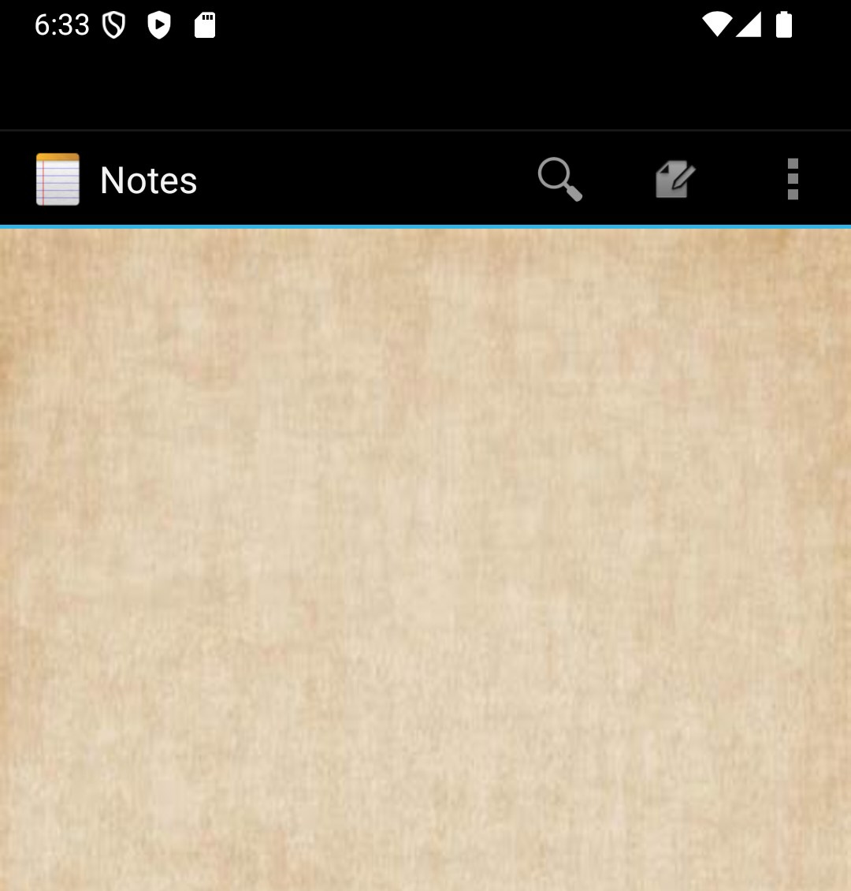
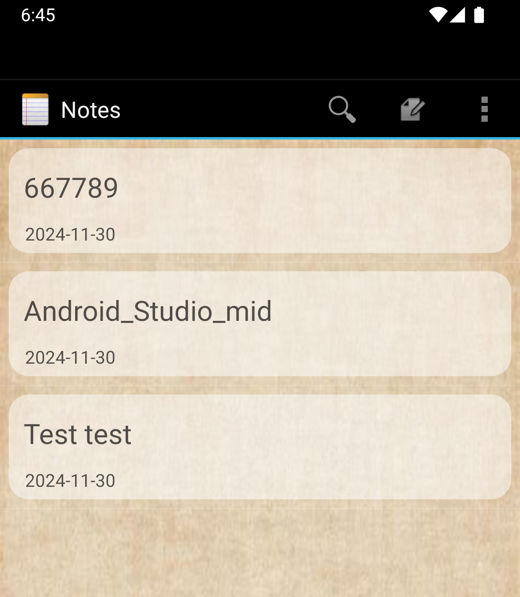
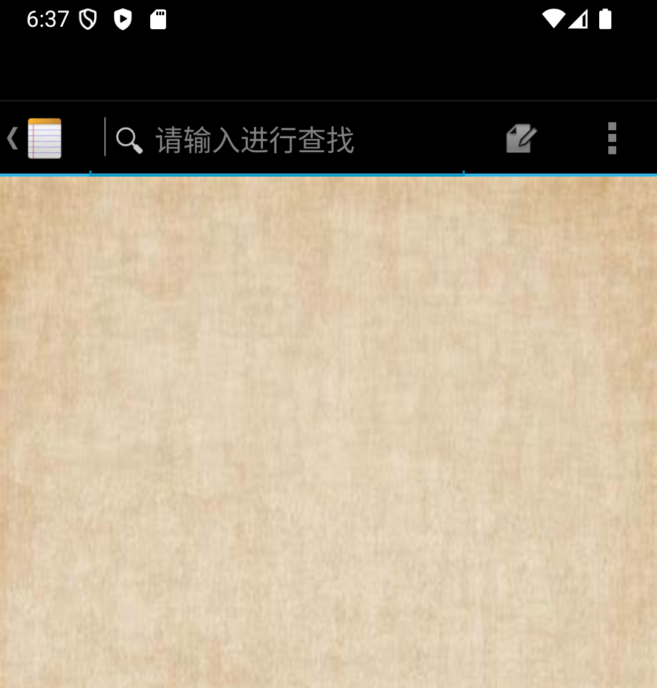
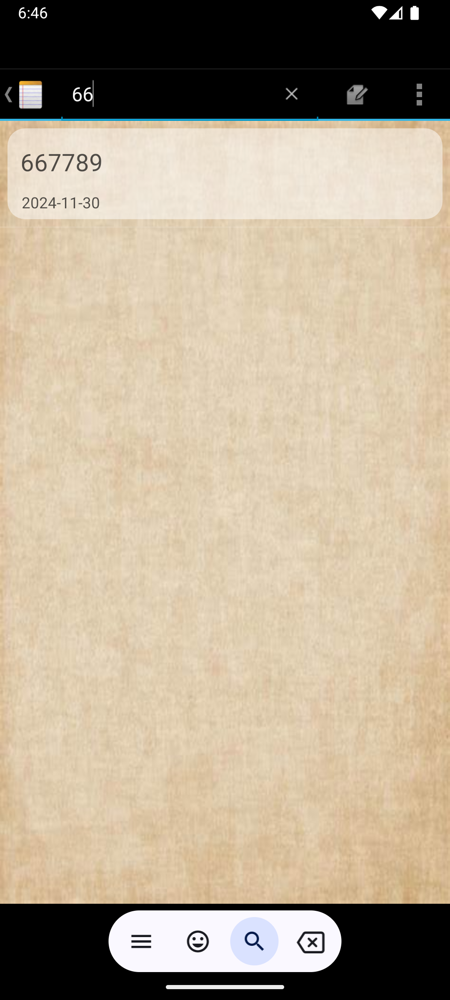
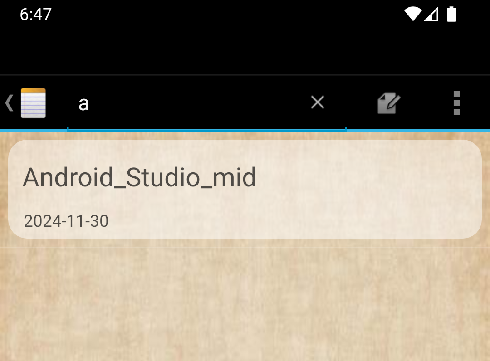
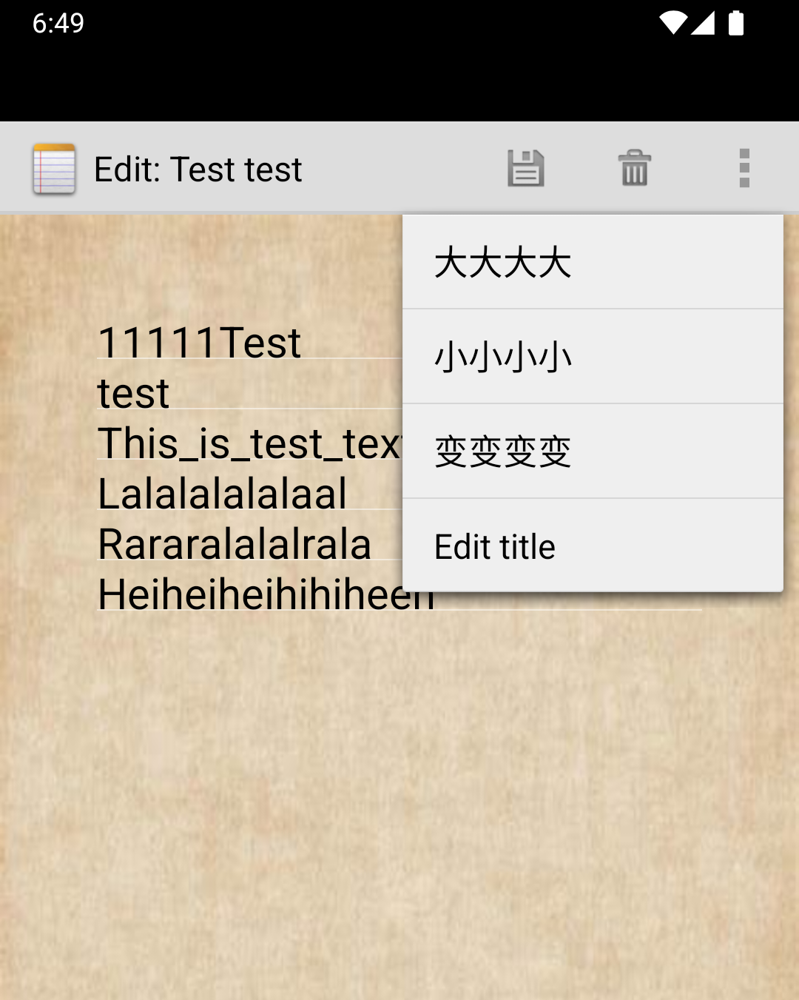

# NotePad - Android 便签应用

NotePad 是一个简单的 Android 便签小应用
用 户可以轻松地添加、删除、搜索和管理便签内容。
它支持便签标题和内容的修改、字体大小和颜色的更改，还支持黏贴便签。

- 
NotePad主页面如图所示
## 拓展功能特性
- ### **标签目录具有时间戳**：能更方便地查看便签的更新时间。
     

- ### **搜索便签**：通过搜索栏快速查找特定的便签。
    
    
    
- ### **更改便签字体大小与颜色**：可以根据个人需求更改便签内容的字体大小和颜色。
    
    
    
    
    
