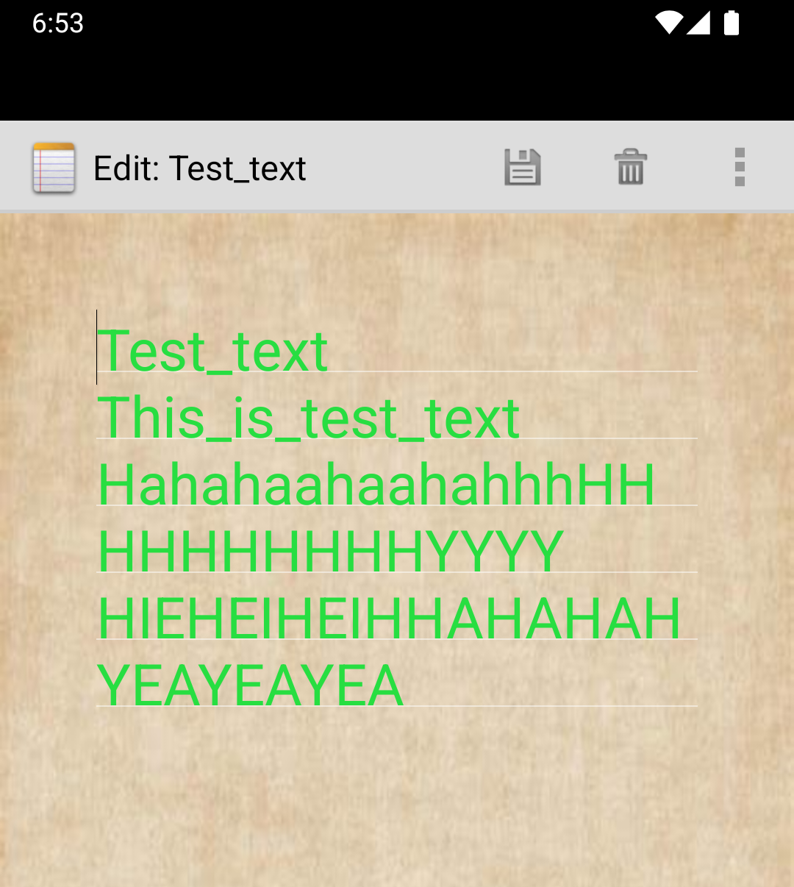

# NotePad - Android 便签应用

### 简介

#### NotePad 是一个简单的 Android 便签小应用 , 用户可以轻松地添加、删除、搜索和管理便签内容。它支持便签标题和内容的修改、字体大小和颜色的更改

- NotePad主页面如图所示

## 拓展功能特性

###   标签目录具有时间戳：能更方便地查看便签的更新时间。

设置布局文件，嵌套线性布局
将title和时间绑定在ListView中
    
     <LinearLayout xmlns:android="http://schemas.android.com/apk/res/android"
         android:layout_width="match_parent"
         android:layout_height="wrap_content"
         android:orientation="horizontal"
         android:layout_marginTop="10dp"
         android:background="?android:attr/selectableItemBackground">
     
         <LinearLayout
             android:layout_width="match_parent"
             android:layout_height="wrap_content"
             android:orientation="vertical"
     
             android:background="@drawable/text_1"
             android:layout_margin="7dp"
             >
     
     
             <TextView
                 android:id="@android:id/text1"
                 android:layout_width="match_parent"
                 android:layout_height="54dp"
                 android:layout_margin="5px"
                 android:gravity="center_vertical"
                 android:paddingLeft="10dip"
                 android:paddingTop="3dip"
                 android:singleLine="true"
                 android:textAppearance="?android:attr/textAppearanceLarge"
                 android:textColor="#AB000000" />
     <!--笔记列表显示笔记条目的时间戳-->
             <TextView
                 android:id="@android:id/text2"
                 android:layout_width="match_parent"
                 android:layout_height="25dp"
                 android:paddingLeft="13dip"
                 android:textColor="#AB000000" />
     
         </LinearLayout>
     </LinearLayout>

在PROJECT中添加关于更新时间的请求   
    `private static final String[] PROJECTION = new String[] {
    NotePad.Notes._ID, // 0
    NotePad.Notes.COLUMN_NAME_TITLE, // 1
    NotePad.Notes.COLUMN_NAME_MODIFICATION_DATE
    };`

    `String[] dataColumns = { NotePad.Notes.COLUMN_NAME_TITLE ,NotePad.Notes.COLUMN_NAME_MODIFICATION_DATE} ;
    // The view IDs that will display the cursor columns, initialized to the TextView in
    // noteslist_item.xml text2笔记列表显示笔记条目的时间戳
    int[] viewIDs = { android.R.id.text1,android.R.id.text2 };`

但要注意的是，此时数据库返回的时间不是我们常用的日期格式，因此需要转化
    `adapter.setViewBinder(new SimpleCursorAdapter.ViewBinder() {
                    @Override
                    public boolean setViewValue(View view, Cursor cursor, int columnIndex) {
                    // Get the column index for the modification date
                    if (columnIndex == cursor.getColumnIndex(NotePad.Notes.COLUMN_NAME_MODIFICATION_DATE)) {
                    // Get the timestamp (in milliseconds) from the cursor
                    long modificationDateInMillis = cursor.getLong(columnIndex);

                    // Format the timestamp to a readable date
                    SimpleDateFormat dateFormat = new SimpleDateFormat("yyyy-MM-dd", Locale.getDefault());
                    String formattedDate = dateFormat.format(new Date(modificationDateInMillis));

                    // Set the formatted date on the TextView (assuming view is a TextView)
                    TextView textView = (TextView) view;
                    textView.setText(formattedDate);

                    return true; // Returning true indicates that we've handled the binding
                }

                return false; // Return false to allow default binding for other columns
            }
        });
        // Sets the ListView's adapter to be the cursor adapter that was just created.
        setListAdapter(adapter);
    }`

### 搜索便签：通过搜索栏快速查找特定的便签。
    
    
    

### 更改便签字体大小与颜色：可以根据个人需求更改便签内容的字体大小和颜色。
    
    
    
    
    
