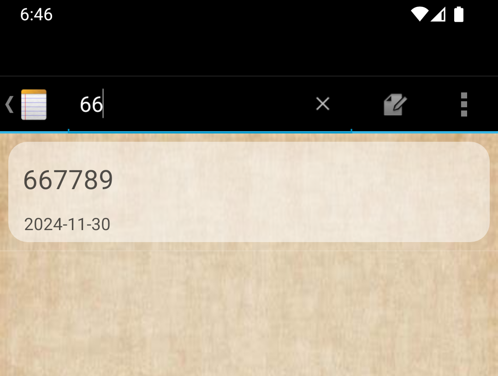
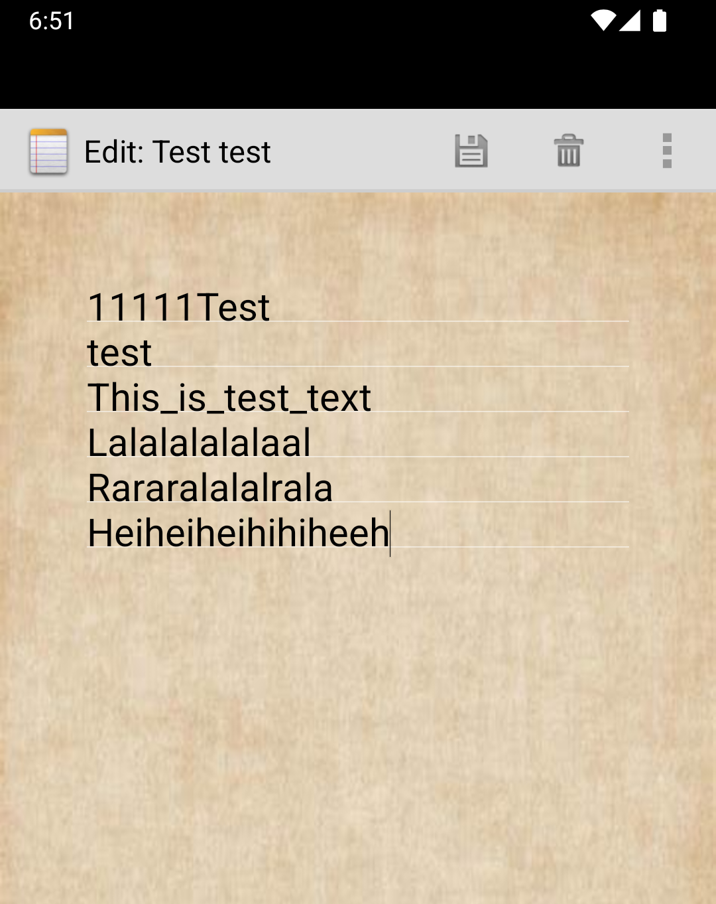

# NotePad - Android 便签应用

### 简介

#### NotePad 是一个简单的 Android 便签小应用 , 用户可以轻松地添加、删除、搜索和管理便签内容。它支持便签标题和内容的修改、字体大小和颜色的更改

- NotePad主页面如图所示

## 拓展功能特性

###   标签目录具有时间戳：能更方便地查看便签的更新时间。

设置布局文件，嵌套线性布局
将title和时间绑定在ListView中
    
     <LinearLayout xmlns:android="http://schemas.android.com/apk/res/android"
         android:layout_width="match_parent"
         android:layout_height="wrap_content"
         android:orientation="horizontal"
         android:layout_marginTop="10dp"
         android:background="?android:attr/selectableItemBackground">
     
         <LinearLayout
             android:layout_width="match_parent"
             android:layout_height="wrap_content"
             android:orientation="vertical"
     
             android:background="@drawable/text_1"
             android:layout_margin="7dp"
             >
     
     
             <TextView
                 android:id="@android:id/text1"
                 android:layout_width="match_parent"
                 android:layout_height="54dp"
                 android:layout_margin="5px"
                 android:gravity="center_vertical"
                 android:paddingLeft="10dip"
                 android:paddingTop="3dip"
                 android:singleLine="true"
                 android:textAppearance="?android:attr/textAppearanceLarge"
                 android:textColor="#AB000000" />
     <!--笔记列表显示笔记条目的时间戳-->
             <TextView
                 android:id="@android:id/text2"
                 android:layout_width="match_parent"
                 android:layout_height="25dp"
                 android:paddingLeft="13dip"
                 android:textColor="#AB000000" />
     
         </LinearLayout>
     </LinearLayout>

在PROJECT中添加关于更新时间的请求   

        private static final String[] PROJECTION = new String[] {
            NotePad.Notes._ID, // 0
            NotePad.Notes.COLUMN_NAME_TITLE, // 1
            NotePad.Notes.COLUMN_NAME_MODIFICATION_DATE
        };
-

        String[] dataColumns = { NotePad.Notes.COLUMN_NAME_TITLE ,NotePad.Notes.COLUMN_NAME_MODIFICATION_DATE} ;
        // The view IDs that will display the cursor columns, initialized to the TextView in
        // noteslist_item.xml text2笔记列表显示笔记条目的时间戳
        int[] viewIDs = { android.R.id.text1,android.R.id.text2 };

但要注意的是，此时数据库返回的时间不是我们常用的日期格式，因此需要转化

    adapter.setViewBinder(new SimpleCursorAdapter.ViewBinder() {
                @Override
                public boolean setViewValue(View view, Cursor cursor, int columnIndex) {
                    // Get the column index for the modification date

                    if (columnIndex == cursor.getColumnIndex(NotePad.Notes.COLUMN_NAME_MODIFICATION_DATE)) {
                    // Get the timestamp (in milliseconds) from the cursor

                    long modificationDateInMillis = cursor.getLong(columnIndex);

                    // Format the timestamp to a readable date
                    SimpleDateFormat dateFormat = new SimpleDateFormat("yyyy-MM-dd", Locale.getDefault());
                    String formattedDate = dateFormat.format(new Date(modificationDateInMillis));

                    // Set the formatted date on the TextView (assuming view is a TextView)
                    TextView textView = (TextView) view;
                    textView.setText(formattedDate);

                    return true; // Returning true indicates that we've handled the binding
                }
                return false; // Return false to allow default binding for other columns
            }
        });
        // Sets the ListView's adapter to be the cursor adapter that was just created.
        setListAdapter(adapter);
    }

### 搜索便签：通过搜索栏快速查找特定的便签。

#### 初始化搜索栏的控件

        @Override
        public boolean onCreateOptionsMenu(Menu menu) {
        // Inflate menu from XML resource

        MenuInflater inflater = getMenuInflater();

        inflater.inflate(R.menu.list_options_menu, menu);
        MenuItem searchItem = menu.findItem(R.id.menu_search);
        // 获取 SearchView 控件
        SearchView searchView = (SearchView) searchItem.getActionView();
        searchView.setQueryHint("请输入进行查找");
        // 设置搜索视图的监听器
        searchView.setOnQueryTextListener(new SearchView.OnQueryTextListener() {
            @Override
            public boolean onQueryTextSubmit(String query) {
                // 在提交时触发过滤
                filterNotes(query);
                return true;
            }

            @Override
            public boolean onQueryTextChange(String newText) {
                // 在输入时触发过滤
                filterNotes(newText);
                return true;
            }
        });
#### filterNotes():

        private void filterNotes(String query) {
        // 获取当前的 URI 和其他参数
        Uri uri = getIntent().getData();

        // 如果用户没有输入搜索内容，显示所有笔记
        if (TextUtils.isEmpty(query)) {
            // 没有查询内容时，重新加载所有笔记
            Cursor cursor = managedQuery(uri, PROJECTION, null, null, NotePad.Notes.DEFAULT_SORT_ORDER);
            ((SimpleCursorAdapter) getListAdapter()).swapCursor(cursor);
        } else {
            // 查询内容不为空时，过滤笔记
            String selection = NotePad.Notes.COLUMN_NAME_TITLE + " LIKE ?";
            String[] selectionArgs = new String[]{"%" + query + "%"};

            // 执行查询，过滤包含查询文本的笔记
            Cursor cursor = managedQuery(uri, PROJECTION, selection, selectionArgs, NotePad.Notes.DEFAULT_SORT_ORDER);
            ((SimpleCursorAdapter) getListAdapter()).swapCursor(cursor);
        }
  }
    

### 更改便签字体大小与颜色：可以根据个人需求更改便签内容的字体大小和颜色。

#### 菜单栏配置

    <item
        android:id="@+id/menu_increase_font_size"
        android:title="大大大大"
        />
    <item
        android:id="@+id/menu_decrease_font_size"
        android:title="小小小小"
        />
    <item
        android:id="@+id/menu_change_font_color"
        android:title="变变变变"
        />

  

            @Override
            public boolean onOptionsItemSelected(MenuItem item) {
            // Handle all of the possible menu actions.
            switch (item.getItemId()) {
            case R.id.menu_save:
                String text = mText.getText().toString();
                updateNote(text, null);
                finish();
            break;
            case R.id.menu_delete:
                deleteNote();
                finish();
                break;
                case R.id.menu_revert:
                cancelNote();
            break;
            case R.id.menu_increase_font_size:
            // 增大字体大小
                float currentSize = mText.getTextSize();
                mText.setTextSize(TypedValue.COMPLEX_UNIT_PX, currentSize + 20);
                return true;
            case R.id.menu_decrease_font_size:
                // 减小字体大小
                float currentSize2 = mText.getTextSize();
                mText.setTextSize(TypedValue.COMPLEX_UNIT_PX, currentSize2 - 20);
                return true;
            case R.id.menu_change_font_color:
                // 改变字体颜色，打开颜色选择器
                int randomTextColor = getRandomColor();
                mText.setTextColor(randomTextColor);
                return true;
        }
#### 变大
    case R.id.menu_increase_font_size:
    // 增大字体大小
        float currentSize = mText.getTextSize();
        mText.setTextSize(TypedValue.COMPLEX_UNIT_PX, currentSize + 20);
    return true;
  

#### 变小
    case R.id.menu_decrease_font_size:
    // 减小字体大小
        float currentSize2 = mText.getTextSize();
        mText.setTextSize(TypedValue.COMPLEX_UNIT_PX, currentSize2 - 20);
    return true;

#### 随机变色
        private int getRandomColor() {
            Random random = new Random();
            // 生成RGB颜色值
            int red = random.nextInt(256);     // 0-255之间的随机数
            int green = random.nextInt(256);   // 0-255之间的随机数
            int blue = random.nextInt(256);    // 0-255之间的随机数
            // 返回颜色，RGB格式
            return Color.rgb(red, green, blue);
    }
##### 1变

    

##### 2变

    

### 最后是一些关于UI的优化

#### 便签整体使用了纸质背景
在note_editor中添加 `android:background="@drawable/background"`即可实现
#### NotePad的首页中记录的样式做了更改
- 划分间隔
- 透明样式
- 圆角
  
            <TextView
             android:id="@android:id/text1"
             android:layout_width="match_parent"
             android:layout_height="54dp"
             android:layout_margin="5px"
             android:gravity="center_vertical"
             android:paddingLeft="10dip"
             android:paddingTop="3dip"
             android:singleLine="true"
             android:textAppearance="?android:attr/textAppearanceLarge"
             android:textColor="#AB000000" />
#### 对编辑文本中的间隔做了更改，变为浅白透明
            public LinedEditText(Context context, AttributeSet attrs) {
                super(context, attrs);
                // Creates a Rect and a Paint object, and sets the style and color of the Paint object.
                mRect = new Rect();
                mPaint = new Paint();
                mPaint.setStyle(Paint.Style.STROKE);
                mPaint.setColor(0xFFFFFFFF);
                //   更改分割线为白色透明

            }
#### titleEdit中弹窗的背景与OK确认键外观改造
            <?xml version="1.0" encoding="utf-8"?>
            <shape xmlns:android="http://schemas.android.com/apk/res/android">
            <solid android:color="#9E000000" /> <!-- 设置背景颜色 -->
            <corners android:radius="16dp" /> <!-- 设置圆角半径 -->
            </shape>